# 📊 Diagramet e Sistemit MailMind

Ky dokument përmban të gjitha diagramet teknike të nevojshme për temën e diplomës "Implementimi i Agjentit Inteligjent për Email-in Tuaj MailMind".

---

## Përmbajtja

1. [Arkitektura e Përgjithshme](#figura-1-arkitektura-e-përgjithshme)
2. [Rrjedha e Autentikimit OAuth 2.0](#figura-2-rrjedha-e-autentikimit-oauth-20)
3. [Rrjedha e të Dhënave (Data Flow)](#figura-3-rrjedha-e-të-dhënave)
4. [Përpunimi i Email-eve](#figura-4-përpunimi-i-email-eve)
5. [Përpunimi i Dokumenteve](#figura-5-përpunimi-i-dokumenteve)
6. [Diagrami i Sekuencës për API](#figura-6-diagrami-i-sekuencës)
7. [Gjendjet e Drafteve (State Diagram)](#figura-7-gjendjet-e-drafteve)
8. [Diagrami i Vendosjes (Deployment)](#figura-8-diagrami-i-vendosjes)
9. [Klasifikimi i Email-eve me NLP](#figura-9-klasifikimi-i-email-eve)
10. [Përmbledhja e Email-eve](#figura-10-përmbledhja-e-email-eve)
11. [Use Case Diagram](#figura-11-use-case-diagram)
12. [ER Diagram (Databaza)](#figura-12-er-diagram)
13. [AI Chatbot Flow](#figura-13-ai-chatbot-flow)
14. [Component Diagram](#figura-14-component-diagram)
15. [AI Proofreader Flow](#figura-15-ai-proofreader-flow)

---

## Figura 1: Arkitektura e Përgjithshme

**Përshkrimi:** Tregon të gjithë komponentët e sistemit dhe lidhjet mes tyre - nga frontend-i React deri te API-të e jashtme.

**Përdorimi:** Kapitulli 5 (Arkitektura e Sistemit)

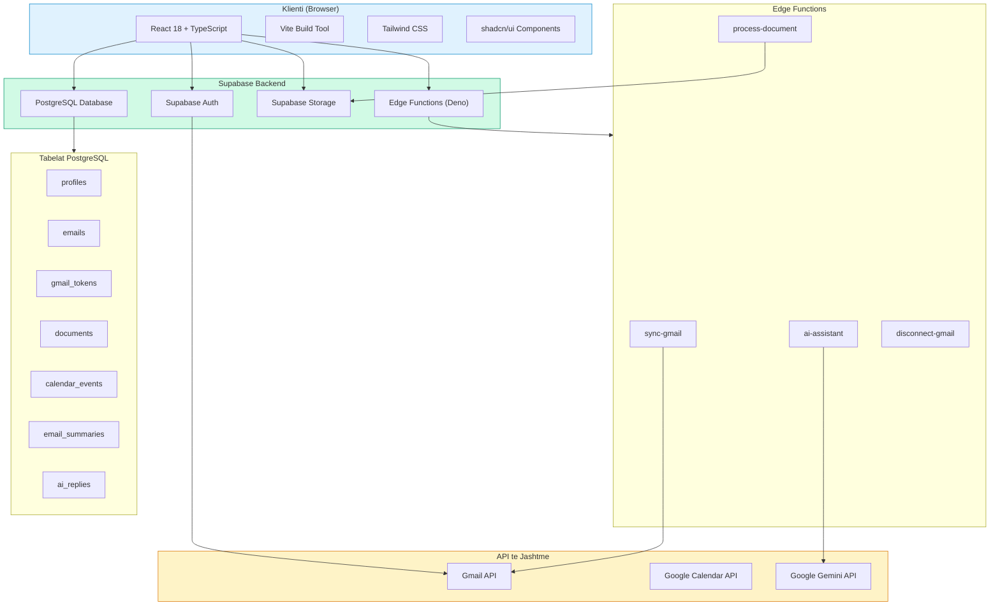

---

## Figura 2: Rrjedha e Autentikimit OAuth 2.0

**Përshkrimi:** Flowchart i detajuar i procesit të autentikimit me Google OAuth 2.0, duke përfshirë të gjithë hapat nga klikimi deri te sesioni.

**Përdorimi:** Kapitulli 5 dhe Kapitulli 8 (Integrimet)

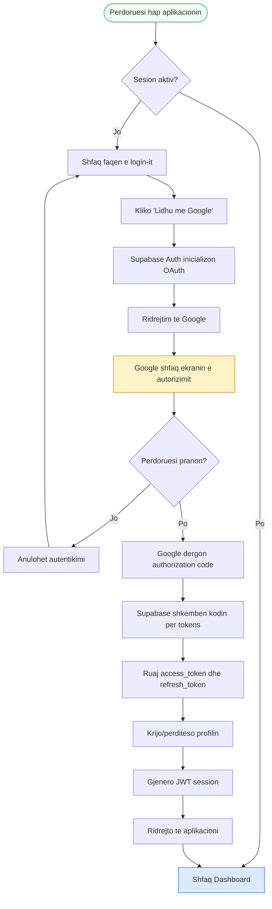

---

## Figura 3: Rrjedha e të Dhënave

**Përshkrimi:** Tregon si lëvizin të dhënat nëpër sistem - nga burimet e jashtme deri te përdoruesi.

**Përdorimi:** Kapitulli 5 (Arkitektura)

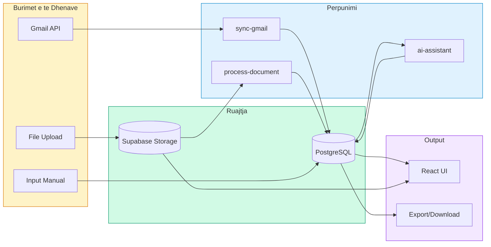

---

## Figura 4: Përpunimi i Email-eve

**Përshkrimi:** Flowchart i detajuar që tregon ciklin e plotë të një email-i nga marrja deri te përgjigja.

**Përdorimi:** Kapitulli 6 (NLP) dhe Kapitulli 7 (Implementimi)

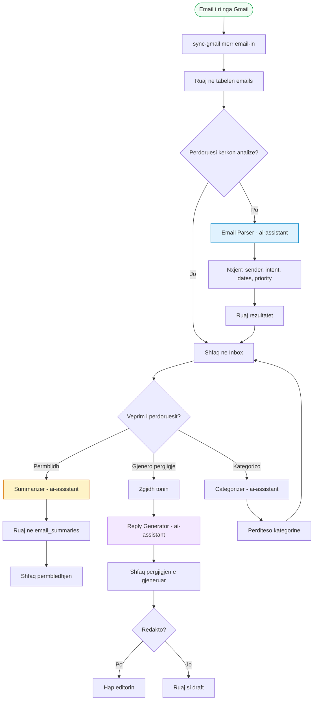

---

## Figura 5: Përpunimi i Dokumenteve

**Përshkrimi:** Tregon procesin e upload-it dhe analizimit të dokumenteve (PDF, Word, TXT).

**Përdorimi:** Kapitulli 7 dhe Kapitulli 8

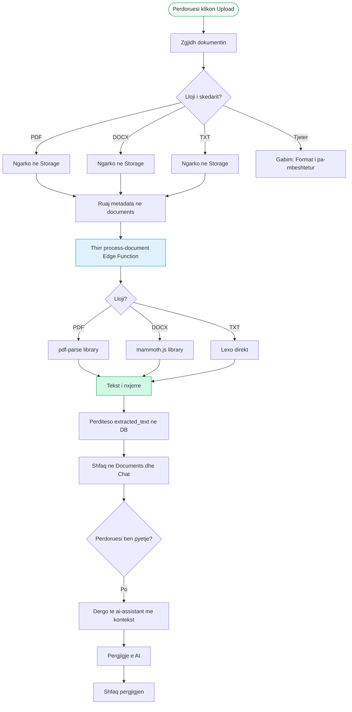

---

## Figura 6: Diagrami i Sekuencës

**Përshkrimi:** Tregon komunikimin midis komponentëve për operacione të ndryshme.

**Përdorimi:** Kapitulli 8 (Integrimet)

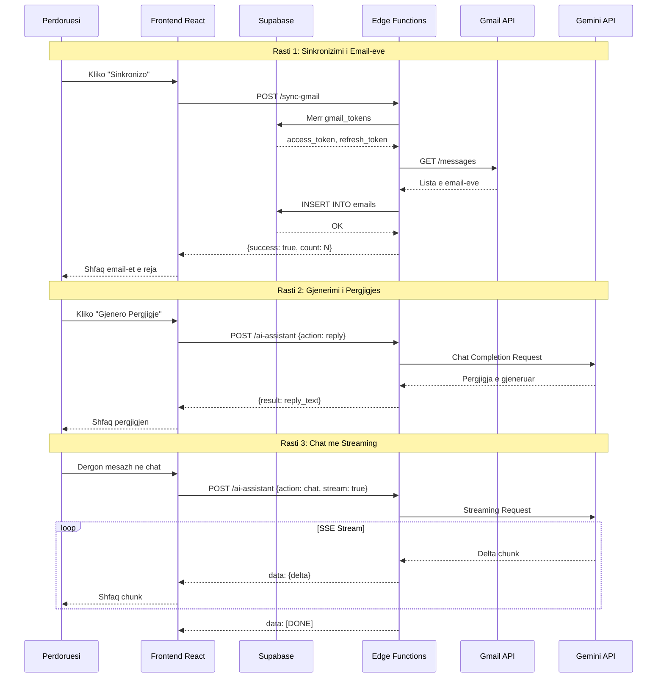

---

## Figura 7: Gjendjet e Drafteve

**Përshkrimi:** State diagram që tregon gjendjet e mundshme të një drafti dhe kalimet.

**Përdorimi:** Kapitulli 5 dhe Kapitulli 7

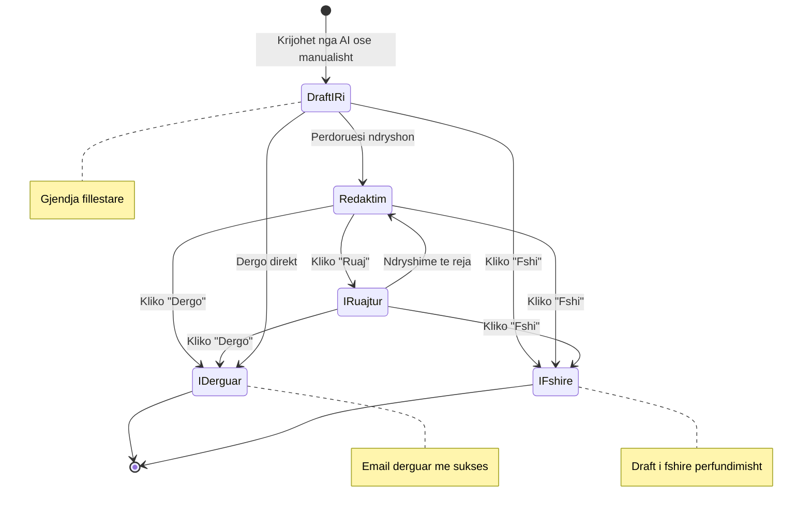

---

## Figura 8: Diagrami i Vendosjes

**Përshkrimi:** Tregon shpërndarjen e komponentëve në infrastrukturën fizike/cloud.

**Përdorimi:** Kapitulli 5 (Arkitektura)

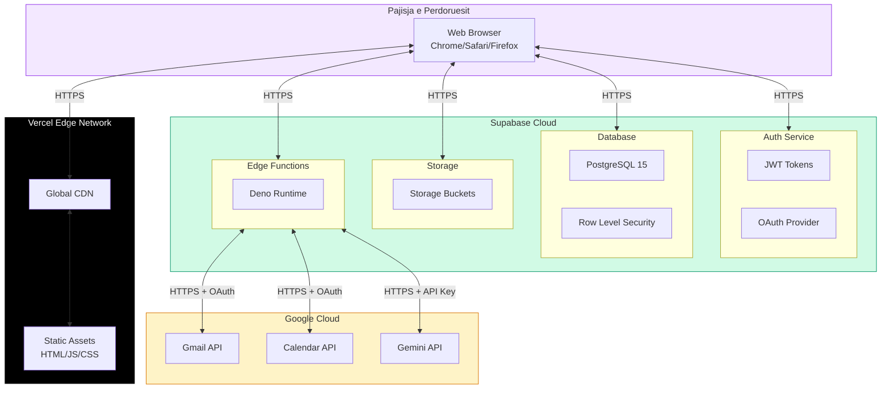

---

## Figura 9: Klasifikimi i Email-eve

**Përshkrimi:** Tregon procesin e klasifikimit të email-eve duke përdorur NLP/LLM.

**Përdorimi:** Kapitulli 6 (Teknikat NLP)

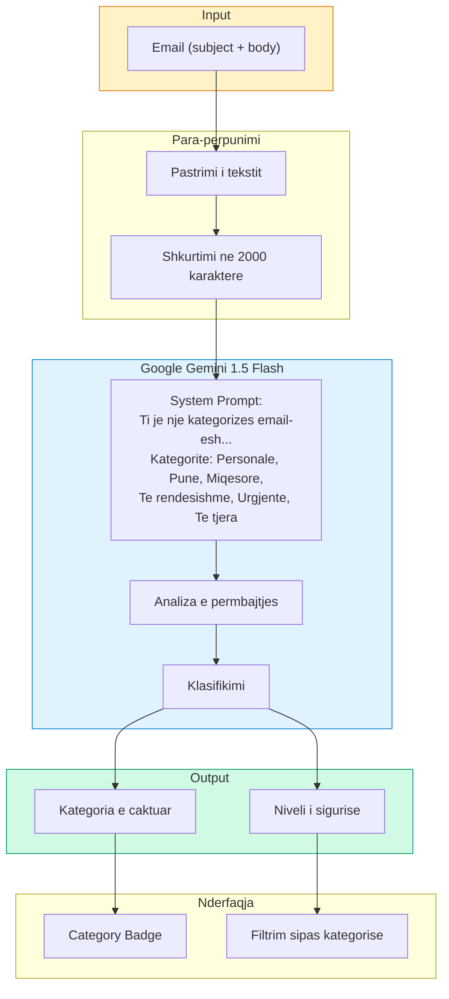

### Shembull i Prompt-it për Kategorizim:

```
You are an email categorizer. For each email provided, assign exactly one category:
- Personale: from family, close friends, personal matters
- Punë: from colleagues, clients, work projects
- Miqësore: from friends, informal tone
- Të rëndësishme: contains deadlines, critical information
- Urgjente: requires action within 24 hours
- Të tjera: anything else

Return JSON: [{"id": "email_id", "category": "category_name"}]
```

---

## Figura 10: Përmbledhja e Email-eve

**Përshkrimi:** Tregon procesin e gjenerimit të përmbledhjeve me AI.

**Përdorimi:** Kapitulli 6 (Teknikat NLP)

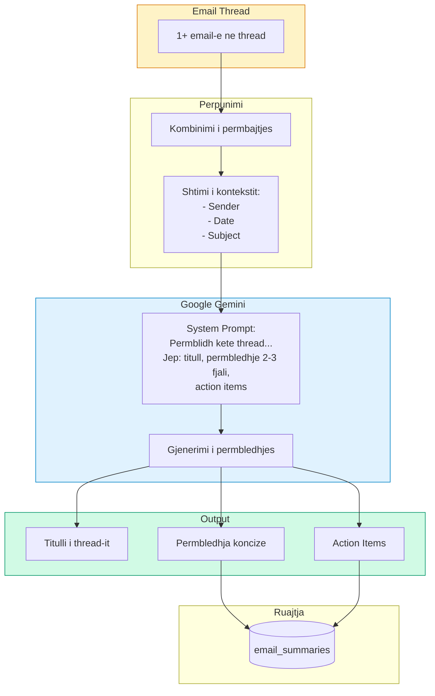

---

## Figura 11: Use Case Diagram

**Përshkrimi:** Tregon aktorët dhe rastet e përdorimit të sistemit.

**Përdorimi:** Kapitulli 5 (Arkitektura)

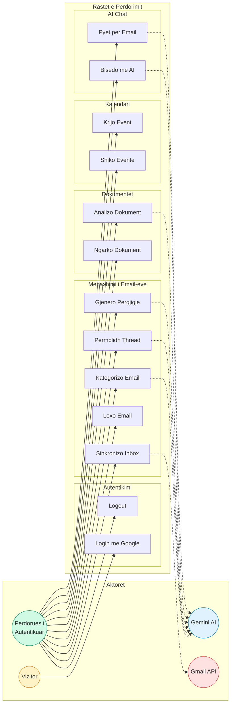

---

## Figura 12: ER Diagram (Databaza)

**Përshkrimi:** Tregon strukturën e bazës së të dhënave dhe marrëdhëniet mes tabelave.

**Përdorimi:** Kapitulli 5 (Arkitektura)

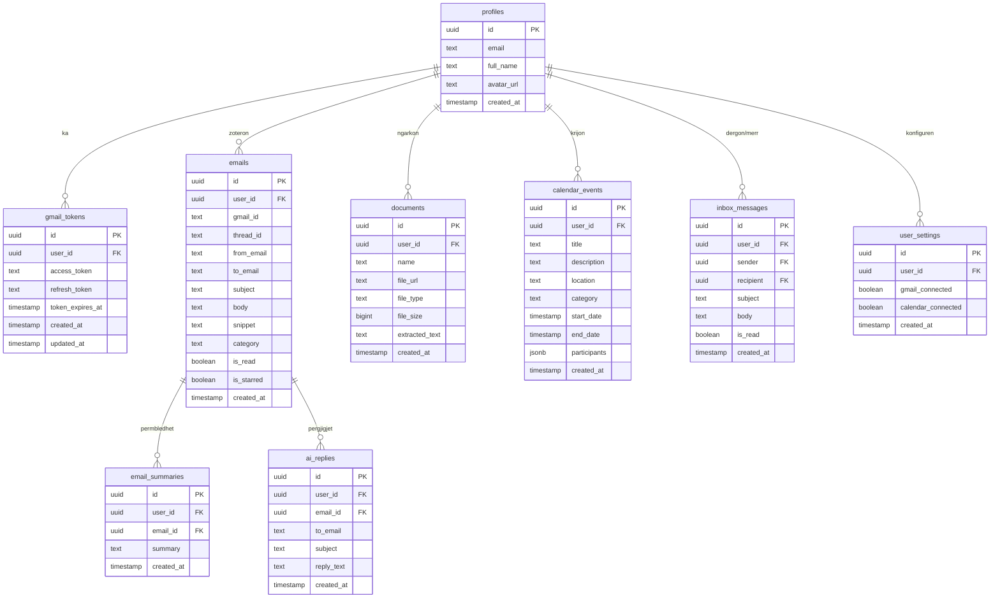

---

## Figura 13: AI Chatbot Flow

**Përshkrimi:** Tregon logjikën e AI Chatbot me streaming dhe kontekst.

**Përdorimi:** Kapitulli 6 dhe Kapitulli 7

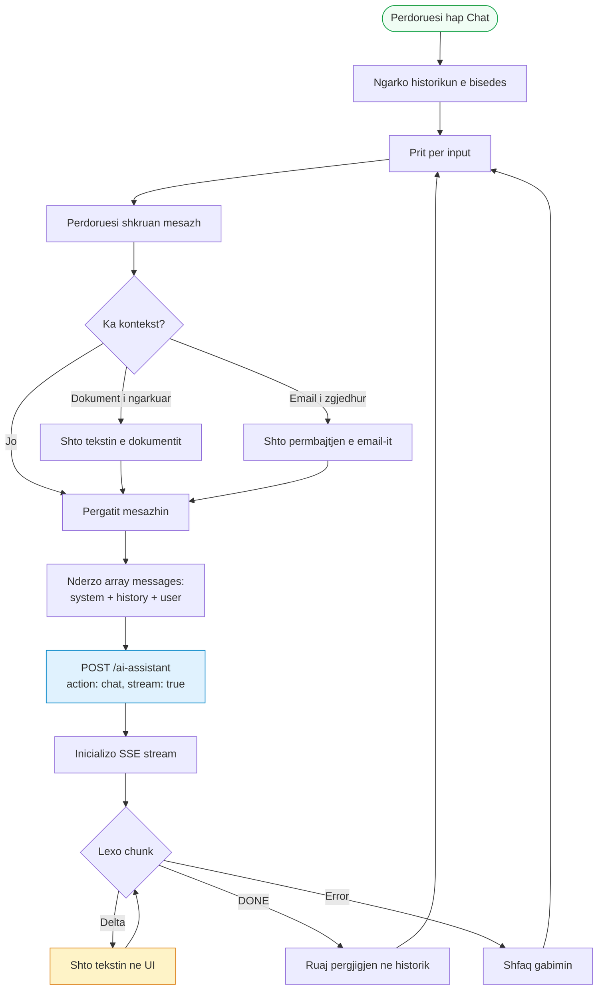

---

## Figura 14: Component Diagram

**Përshkrimi:** Tregon organizimin e kodit në komponentë dhe module.

**Përdorimi:** Kapitulli 5 dhe Kapitulli 7

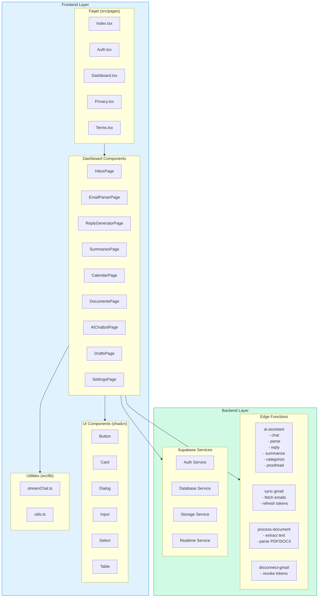

---

## Figura 15: AI Proofreader Flow

**Përshkrimi:** Tregon procesin e korrigjimit të drafteve me AI.

**Përdorimi:** Kapitulli 6 dhe Kapitulli 7

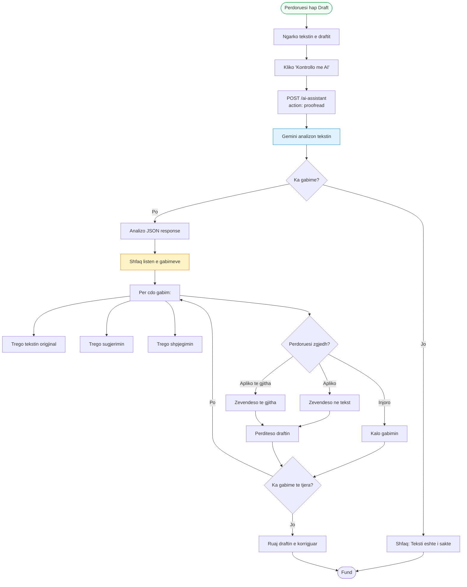

### Formati i JSON Response nga AI Proofreader:

```json
{
  "issues": [
    {
      "original": "teksti me gabim",
      "suggestion": "teksti i korrigjuar",
      "explanation": "Arsyeja e korrigjimit"
    }
  ],
  "corrected_text": "Teksti i plote i korrigjuar"
}
```

---

## Referencat e Kapitujve

| Figura | Kapitulli 5 | Kapitulli 6 | Kapitulli 7 | Kapitulli 8 |
|--------|-------------|-------------|-------------|-------------|
| 1. Arkitektura | ✅ | | | |
| 2. OAuth Flow | ✅ | | | ✅ |
| 3. Data Flow | ✅ | | | |
| 4. Email Processing | | ✅ | ✅ | |
| 5. Document Processing | | | ✅ | ✅ |
| 6. Sequence Diagram | | | | ✅ |
| 7. State Diagram | ✅ | | ✅ | |
| 8. Deployment | ✅ | | | |
| 9. NLP Classification | | ✅ | | |
| 10. Summarization | | ✅ | | |
| 11. Use Case | ✅ | | | |
| 12. ER Diagram | ✅ | | | |
| 13. Chatbot Flow | | ✅ | ✅ | |
| 14. Component Diagram | ✅ | | ✅ | |
| 15. Proofreader Flow | | ✅ | ✅ | |

---

## Si të Përdorni Këto Diagrame

1. **Në LaTeX/Word**: Kopjoni kodin Mermaid dhe përdorni një tool si [Mermaid Live Editor](https://mermaid.live/) për të eksportuar si PNG/SVG
2. **Në Markdown**: Diagramet renderohen automatikisht në GitHub dhe shumë platforma të tjera
3. **Për printim**: Eksportoni në rezolucion të lartë (2x) për cilësi optimale

---

*Dokumenti u krijua automatikisht për projektin MailMind - Tema e Diplomës 2024*
